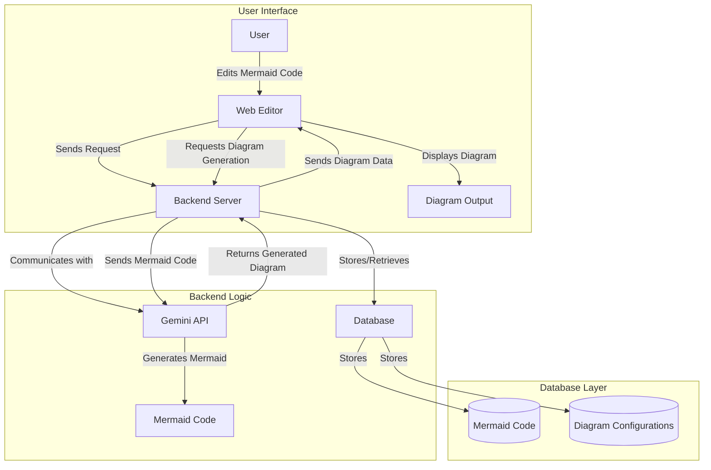

# Dmaid.cloud
Dmaid.cloud is a Mermaid based diagram editor that allows you to create and edit diagrams in real-time. It is a web-based application that can be accessed from any device with a web browser. Dmaid.cloud is designed to be easy to use and intuitive, so you can create professional-looking diagrams quickly and easily.

# Architecture

# Project Details 
https://www.tldraw.com/f/4CtJWrRjnFN-ORD68BzyE

# Technologies
- React
- Express
- MongoDB
- TypeScript
- Google Gemini APIs

# Deployments and URLS
- Client URL: [https://dmaid.cloud](https://dmaid.cloud)
- Server URL: [https://api.dmaid.cloud](https://api.dmaid.cloud)